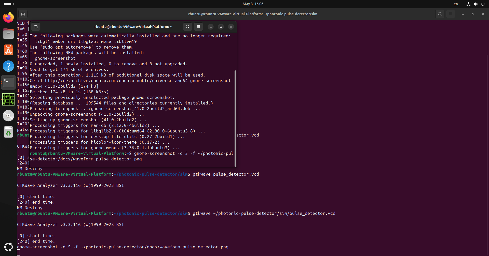
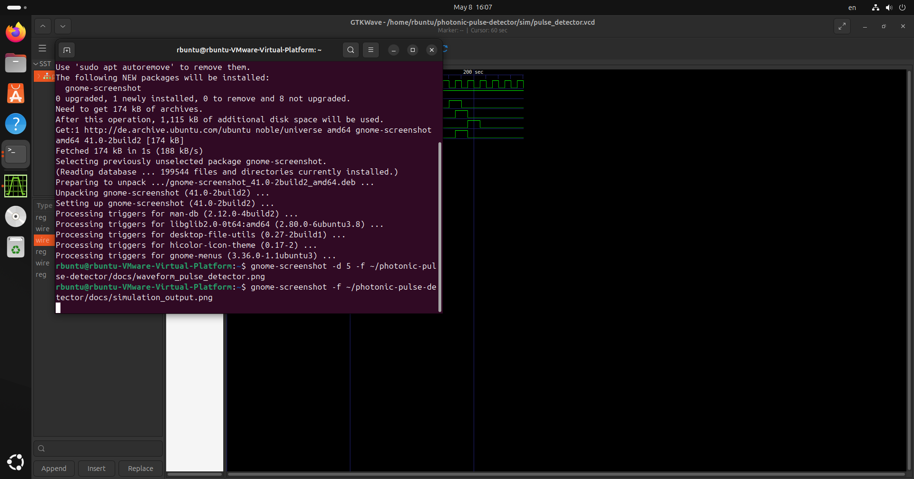

# Photonic Pulse Detector IC

A digital IC that detects and analyzes optical pulses — implemented from RTL to GDS on SKY130 130nm PDK.

## What it does
- Detects rising and falling edges of optical pulses
- Measures pulse width in clock cycles
- Counts pulse frequency per second
- Streams data via UART to laptop for live visualization

## Applications
- Photonic LiDAR pulse processing
- Optical fiber signal monitoring
- Photodetector readout circuits
- Optical communications testing

## Tools Used
- Verilog HDL — RTL design
- Icarus Verilog — functional simulation
- GTKWave — waveform viewing
- OpenLane — RTL to GDS flow
- SKY130 PDK — 130nm process
- Python matplotlib — live visualization

## Project Structure
- src/ — Verilog RTL source files
- sim/ — testbenches and simulation files
- docs/ — documentation and screenshots

## Simulation Results

### Waveform

### Terminal Output

