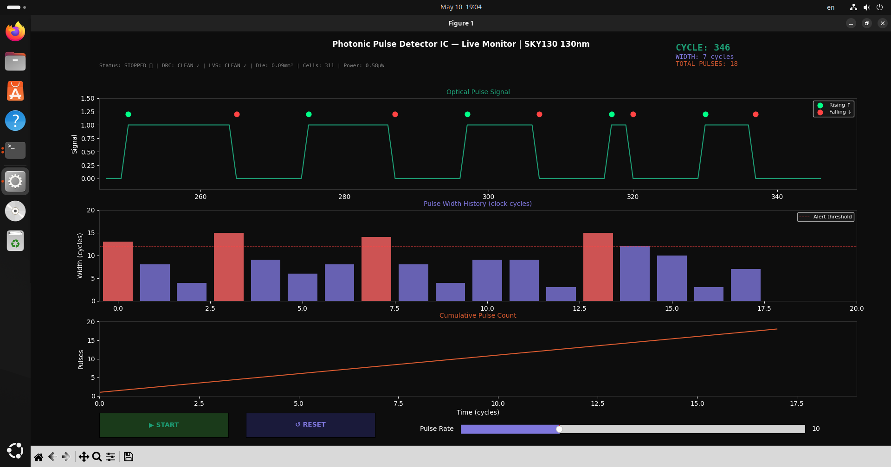
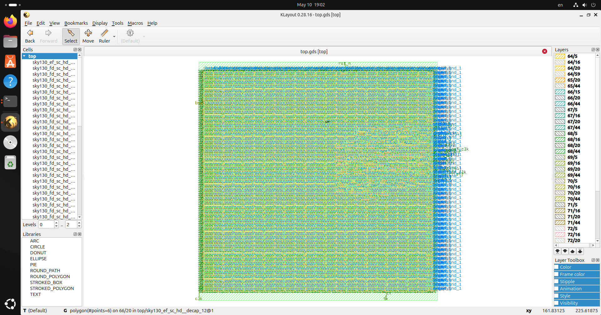
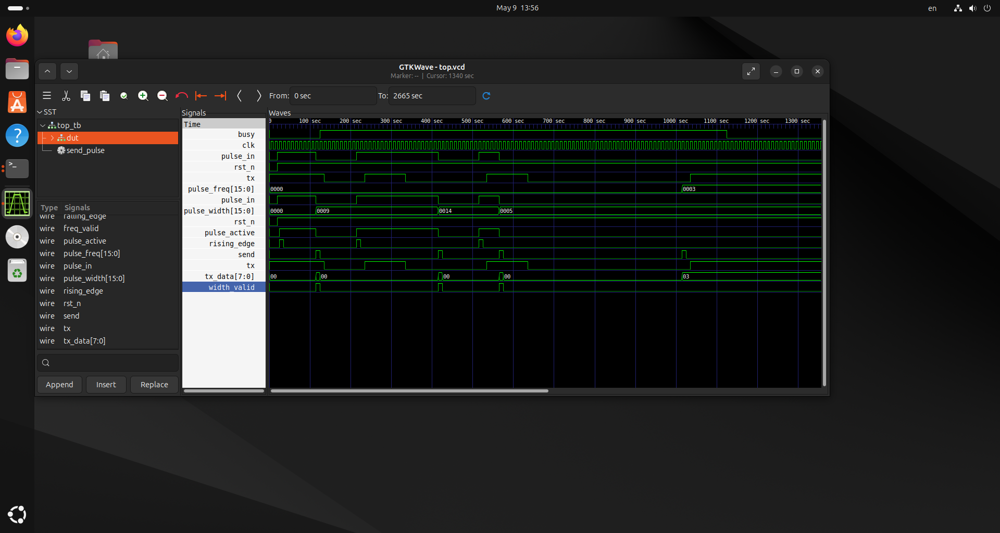
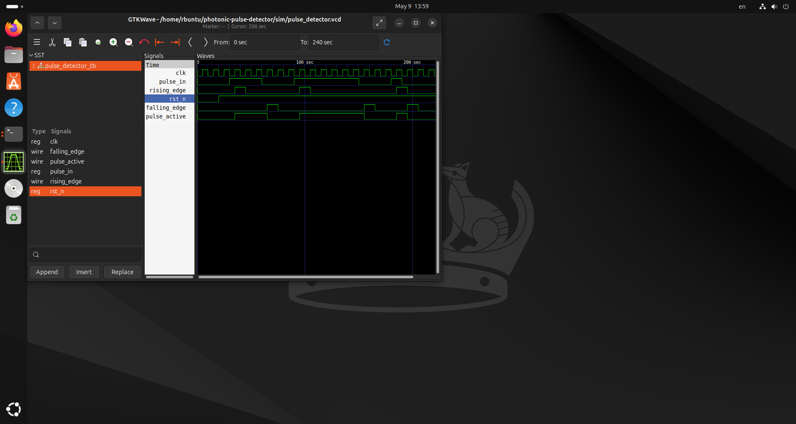
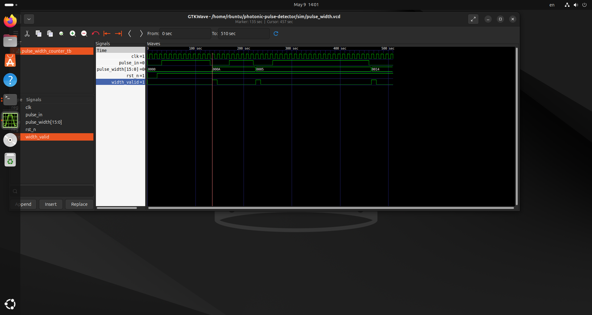
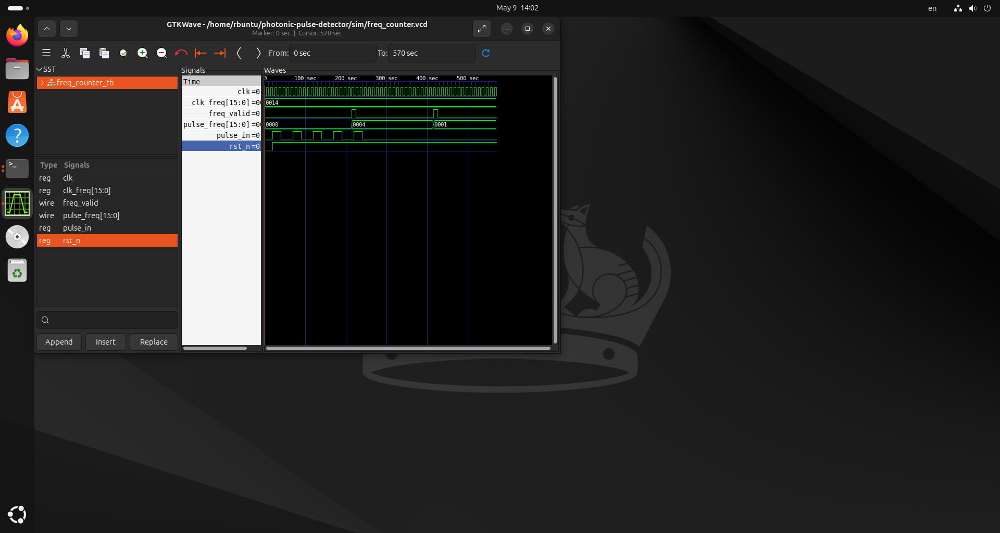
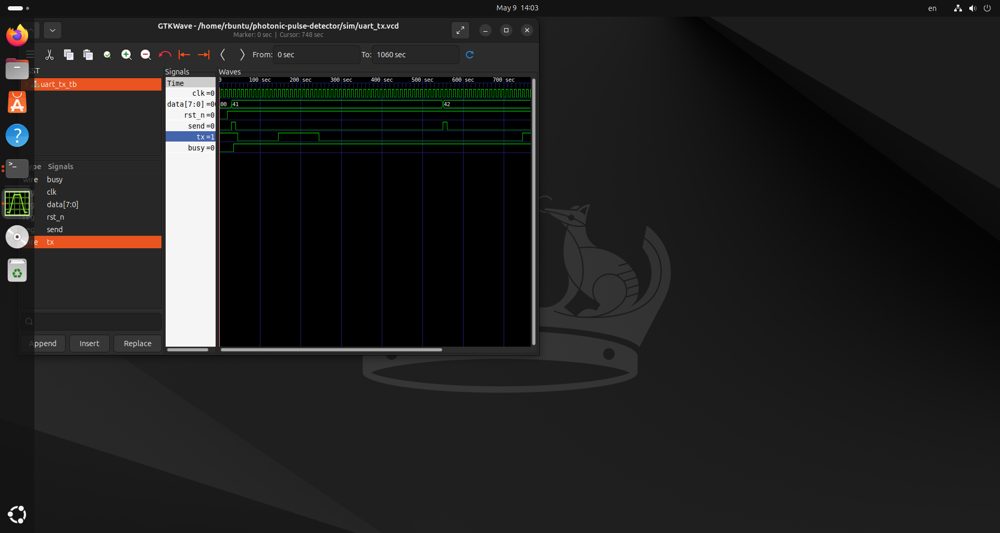

# Photonic Pulse Detector IC

A digital IC that detects and analyzes optical pulses — 
implemented from RTL to GDS on SKY130 130nm PDK.

**Author:** Rohit Yadav  
**University:** TU Chemnitz, Germany  
**Program:** MSc Design and Test of Integrated Circuits  
**Date:** May 2026  

---

## Live Visualization Dashboard



---

## Chip Layout — KLayout GDS View



---

## What This Chip Does

This chip processes optical pulse signals — the same 
technology used in photonic LiDAR sensors, fiber optic 
receivers and photodetector readout circuits.

It detects when a light pulse starts and stops, measures 
how long each pulse lasts, counts the pulse frequency, 
and streams all data to a laptop via UART for live 
visualization.

This design implements digital pulse processing logic 
that forms the foundation of optical computing signal 
chains — directly relevant to all-optical processor 
architectures.

---

## Block Diagram

Light Pulse Input
↓
┌─────────────────┐
│  Module 1       │
│  Pulse Detector │ → detects rising + falling edges
└────────┬────────┘
↓
┌─────────────────┐
│  Module 2       │
│  Width Counter  │ → measures pulse width in cycles
└────────┬────────┘
↓
┌─────────────────┐
│  Module 3       │
│  Freq Counter   │ → counts pulses per second
└────────┬────────┘
↓
┌─────────────────┐
│  Module 4       │
│  UART TX        │ → streams data to laptop
└────────┬────────┘
↓
Python Dashboard
(live visualization)

---

## Chip Statistics

| Metric | Value |
|--------|-------|
| Process | SKY130 130nm |
| Die Area | 0.09 mm² |
| Logic Cells | 311 |
| Total Cells | 8,297 |
| Wire Length | 7,988 µm |
| Vias | 2,317 |
| Critical Path | 1.42 ns |
| Clock Frequency | 50 MHz |
| Timing Slack | 18.58 ns |
| Total Power | 0.58 µW |
| Flow Runtime | 2 min 33 sec |

---

## Signoff Results

| Check | Result |
|-------|--------|
| DRC Violations | 0 ✓ |
| LVS Errors | 0 ✓ |
| Setup Violations | 0 ✓ |
| Hold Violations | 0 ✓ |
| Fanout Violations | 0 ✓ |
| Antenna Violations | 1 (minor) |
| LVS Nets Matched | 396 ✓ |

---

## Simulation Waveforms

### Complete Chip — Top Module


### Module 1 — Pulse Detector


### Module 2 — Pulse Width Counter


### Module 3 — Frequency Counter


### Module 4 — UART Transmitter


---

## Tools Used

| Tool | Purpose |
|------|---------|
| Verilog HDL | RTL design |
| Icarus Verilog | Functional simulation |
| GTKWave | Waveform viewing |
| OpenLane v1.0.2 | RTL to GDS flow |
| OpenROAD | Placement and routing |
| Magic | DRC signoff |
| Netgen | LVS signoff |
| OpenSTA | Static timing analysis |
| SKY130A PDK | 130nm process |
| KLayout | Layout viewing |
| Python matplotlib | Live visualization |

---

## How to Run Simulation

```bash
cd sim
iverilog -o top_sim top_tb.v ../src/top.v \
  ../src/pulse_detector.v \
  ../src/pulse_width_counter.v \
  ../src/freq_counter.v \
  ../src/uart_tx.v
vvp top_sim
gtkwave top.vcd
```

## How to Run Live Visualization

```bash
python3 visualizer.py
```

## How to Run Metrics Parser

```bash
python3 parse_metrics.py
```

## How to Run OpenLane Flow

```bash
cd ~/OpenLane
make mount
./flow.tcl -design photonic_pulse_detector
```

---

## Project Structure

photonic-pulse-detector/
├── src/
│   ├── top.v                    — top level module
│   ├── pulse_detector.v         — edge detection
│   ├── pulse_width_counter.v    — width measurement
│   ├── freq_counter.v           — frequency counting
│   └── uart_tx.v                — serial output
├── sim/
│   ├── top_tb.v                 — full system testbench
│   ├── pulse_detector_tb.v      — module 1 testbench
│   ├── pulse_width_counter_tb.v — module 2 testbench
│   ├── freq_counter_tb.v        — module 3 testbench
│   └── uart_tx_tb.v             — module 4 testbench
├── docs/
│   ├── chip_layout.png          — KLayout GDS view
│   ├── live_visualization.png   — Python dashboard
│   └── waveform_*.png           — simulation waveforms
├── visualizer.py                — live Python dashboard
├── parse_metrics.py             — metrics parser
├── metrics.csv                  — OpenLane metrics
├── manufacturability.rpt        — DRC/LVS/Antenna report
└── timing_report.rpt            — STA signoff report


